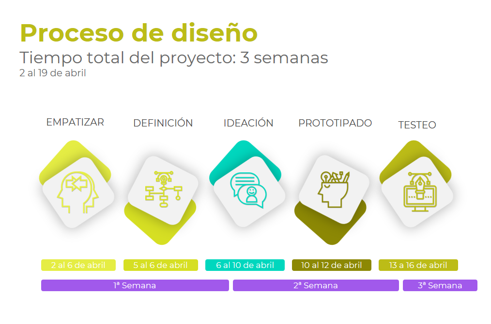
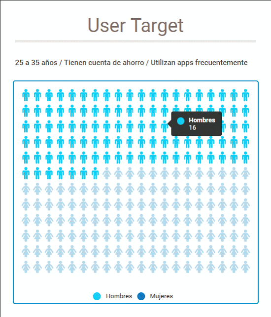
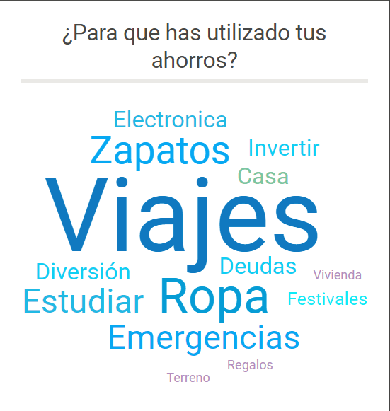
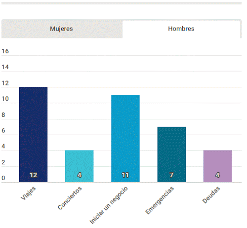
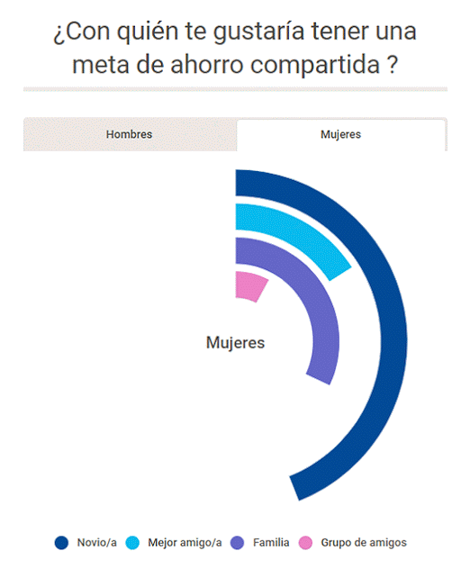
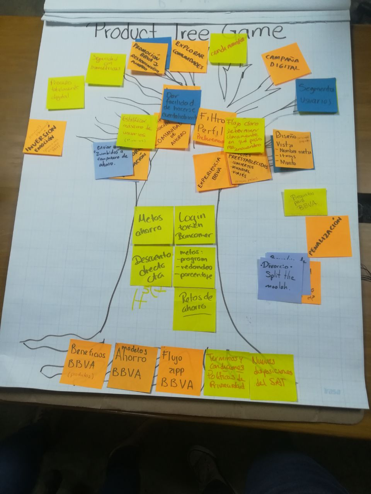
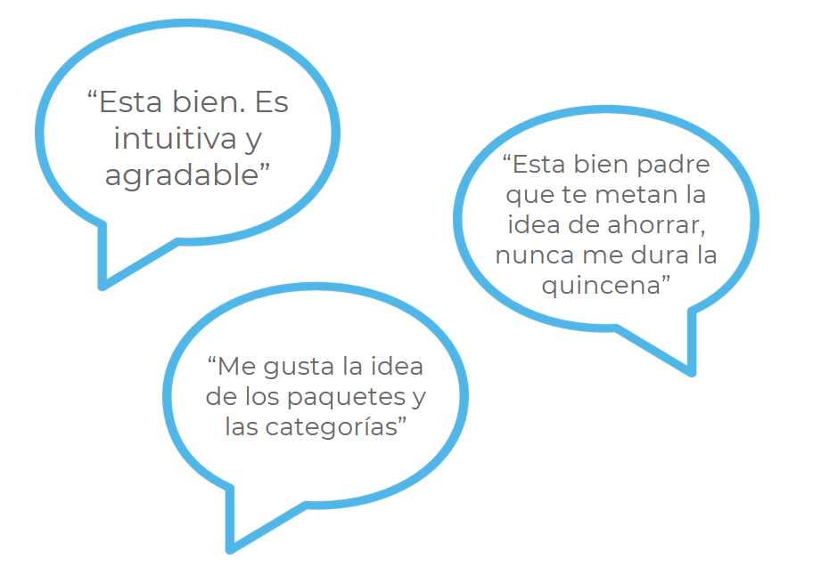
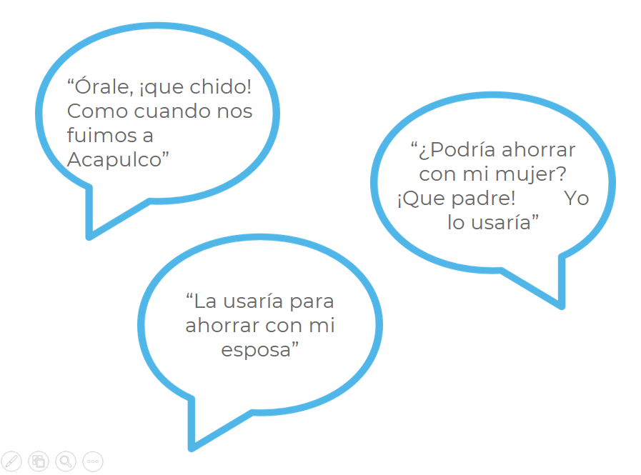

# BBVA PLAN - METAS COMPARTIDAS
 Ver prototipo aquí: https://app.atomic.io/d/6iUXfnGP3yvr

## RETO

Implementar la opción de Meta de Ahorro Compartida dentro del flujo de la ya existente app BBVA Plan, explorar su viabilidad y añadir valor al usuario de modo que a través de su experiencia incentiven a otros a unirse a BBVA. 

## Definición del problema

En tres semanas:

* Desarrollar la funcionalidad de Metas compartidas en app BBVA Plan. 

* Utilizarlo como una herramienta de crecimiento al buscar involucrar usuarios que no tienen BBVA Plan o una cuenta de BBVA Bancomer.

## Hipótesis

Los usuarios estarán interesados en el ahorro compartido si se les ofrece valor agregado en los productos digitales actuales de BBVA Bancomer.

## Conociendo al Usuario

Recursos:

[Mitofsky - Los Mexicanos y el Ahorro 2017](http://consulta.mx/index.php/estudios-e-investigaciones/mexico-opina/item/954-los-mexicanos-y-el-ahorro)
[Encuesta Nacional de Inclusión Financiera 2015](http://www.cnbv.gob.mx/Inclusi%C3%B3n/Paginas/Encuestas.aspx)

### Perfilamiento

* Definir y crear herramienta de recolección de datos: Cuestionario.
* 47 usuarios, perfiles mixtos.
* Objetivos del cuestionario: conocer hábitos de ahorro + definir nuestro user target

### Insights Relevantes

User target:
25 a 35 años / Tiene cuenta de ahorro / Utiliza apps frecuentemente

¿Para qué has utilizado tus ahorros?
*¡Viajes!*

## Conociendo al cliente

Recursos:

[Informe Brandwatch - Sector Financiero en México 2017](https://www.brandwatch.com/es/reports/informe-brandwatch-sector-financiero-en-mexico/)
[Modelos de Negocios - Bancos](./assets/resources/modelos_de_negocio_bancos.pdf)

## Definición de Producto

Organizamos nuestra lluvia de ideas a través de la dinámica "Product Tree Game" para generar un backlog de producto y a su vez definir un Producto Mínimo Viable.

* Raíces: En las raíces se colocan los elementos indispensables que soportan el producto
* Tronco: Aquí se colocan los elementos que actualmente ya existen y forman parte del producto
* Ramas: En las ramas se empiezan a categorizar las nuevas ideas
* Hojas: Cada hoja representa una propuesta particular siendo las más cercanas al tronco las más viables, a medida que las hojas se alejan del centro significa que las ideas son más complejas, presentan mayores retos para llevarse a cabo o simplemente no son tan relevantes en primera instancia para nuestro MVP. 

## Propuesta de solución

Creación, construcción y desarrollo de un feature en su ya existente aplicación BBVA Plan que invite a usuarios que ya son cuentahabientes a ahorrar con otros usuarios hacia una meta común. Se espera que los cuenthabientes que utilicen esta aplicación incentiven a otros usuarios a unirse a BBVA  a través de la posibilidad de ahorrar de manera conjunta.

Nuestra propuesta incluye añadir paquetes especiales personalizados y sugerencias de paquetes atractivos enfocados en viajes o experiencias que engloben una serie de productos y/o servicios con base en los convenios de BBVA con diferentes empresas y proveedores. 

En el prototipo se muestra como ejemplo el flujo de meta compartida para adquirir el paquete "Pa'l Norte", un paquete que incluye viaje y acceso al evento disfrutando de todos los beneficios de la experiencia Bancomer. 

## Objetivo de la solución

Crear un feature llamado Meta Compartida dentro de la aplicación BBVA Plan que incentive el hábito del ahorro colaborativo en los usuarios que actualmente ya son cuentahabientes del banco en un periodo de 6 meses.

Nos interesa que el usuario se imagine a sí mismo alcanzando su meta con aquella persona con la que realiza su ahorro y que cada caso de éxito sea un incentivo para continuar ahorrando. La expectativa a largo plazo, es ofrecer propuestas de inversión u otro tipo de productos financieros una vez que el usuario haya demostrado una actividad exitosa recurrente.

## Primera prueba

Prototipo clickeable de baja fidelidad.

* Entrevistas moderadas: 10 usuarios
* Flujo, IA.

## Segunda prueba

Prototipo clickeable de alta fidelidad con el diseño final.

* Entrevistas moderadas: 10 usuarios
* Elementos de la app, diseño amigable con el usuario
* Iconos : elementos, amigable con el usuario

[Ir al Prototipo](https://app.atomic.io/d/6iUXfnGP3yvr)

